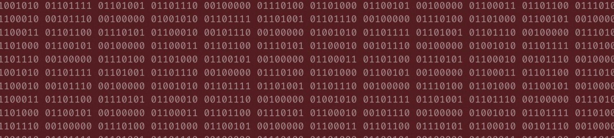

# Hello World!

This is AURAK's Student Coding Club. Welcome to our GitHub! Our club is dedicated to fostering a passion for coding and technology among students at the American University of Ras Al Khaimah. Whether you're a beginner or an experienced coder, our club offers a welcoming community where you can learn, collaborate, and unleash your creativity through coding projects and activities.

The club brings together tech enthusiasts for a range of exciting activities that blend learning with fun. From sharing weekly Tech Talks to lively biweekly Dev Discussions in G's AutoCAD lab (live streaming on Google Meets). We spice things up with coding competitions, handy tech tool recommendations, and review sessions during midterm and final exam periods. Plus, we're not afraid to venture beyond campus, organizing field trips to conferences and tech events. Wait there's more: memes, polls, collabs, and typeathons!

  
 [Archived] Spring 2024 

- [x] Renovate all of the club's brand graphics.
- [x] Establish an online presence on Github, YouTube, and Email.
- [x] Advertise vacant positions. (x3) 
- [x] Hire a new management team.
- [x] Acquire department faculty sponsors.
- [x] Establish Tech Talks: the weekly news, announcements, projects, polls, and memes post.
- [x] Establish Dev Discussions: 4 meet-ups per semester where we cover some extracurricular CS topics.
- [x] Establish Review Rounds: the YT review videos posted to aid students in preparing for their midterms and finals at AURAK.
- [x] [Winning Most Active Student Club Award.](cert.png)

**Total number of Tech Talks posted: 8**  
**Total number of Dev Discussions hosted: 2**  
**Total number of Review Rounds posted: 4**  
**Total number of events organized: 0**  

  
 [Archived] Summer 2024 

- [x] Hire a team of reviewers for Review Rounds.
- [x] Rebrand Tech Talk as a magazine.
- [x] Hire a graphic designer.
- [x] Books & Bytes collab with the Book Club. Created a tech-themed summer reading list and hosted an online reflective discussion. 

**Total number of Tech Talks posted: 9**  
**Total number of Dev Discussions hosted: 0**  
**Total number of Review Rounds posted: 2**  
**Total number of events organized: 1**  

  
 [Archieved] Fall 2024 

- [x] Participate in AURAK's club fair (banner, brochures, posters, typathons, and personality tests).
- [x] Renovate the Tech Titans Rewards & Penalties system.
- [x] Organize a trip to Wetex 2024.
- [x] Organize the department orientation event for freshmen `cout << "Hello World!";`
- [x] Collab with the Gaming Club on the Rubik's Cube event.
- [x] Collab with the Volunteering Club on the Rubik's Cube event.
- [x] Collab with Music Club on "Experience the Sound of Code" Dev Discussion.
- [x] [Winning Most Active Student Club Award.](cert2.jpg)

**Total number of Tech Talks posted: 10**  
**Total number of Dev Discussions hosted: 4**  
**Total number of Review Rounds posted: 4**  
**Total number of events organized: 4**  

  
 [Ongoing] Fall 2025 

 

**Total number of Tech Talks posted: 1**  
**Total number of Dev Discussions hosted: 0**  
**Total number of Review Rounds posted: 0**  
**Total number of events organized: 0**  
**Total amount of budget used: 0 AED**  

This is a semesterly competitive leaderboard set to foster student engagement in club activities. Top 3 ranks will be awarded Coding Club Tech Titan certificates from AURAK's Department of Computer Science & Engineering.

  
 Reward & Penalty System

  
As of Fall 2024, the points accumulate through a binary-themed multiplier system. Every member of the club starts at 1 by default and enters the leaderboard once they activate a multiplier. Keep an eye out for the penalty system!

- **(pts x 2)** for voting on Tech Talk polls and staying engaged.
- **(pts x 4)** for getting featured in the programming memes competition.
- **(pts x 4)** for attending Dev Discussions.
- **(pts x 4)** for engaging in any requested volunteering activities/gigs.
- **(pts x 4)** for releasing major updates to an already submitted project.
- **(pts x 8)** for getting 1st place in typeathons.
- **(pts x 8)** for getting 1st place in a mentimeter question.
- **(pts x 8)** for participating in official coding club competitions.
- **(pts x 16)** for submitting a project to showcase in Dev Discussions.
- **(pts x 32)** for winning a 1st, 2nd, or 3rd place in official coding club competitions.
- **(pts x 32)** for winning best submitted project of the semester (including personal and course projects.)
- **(pts / 2)** for failing to meet the responsibilities of a volunteer position within the club.
- **(pts / 4)** for repeatedly ignoring club guidelines or expectations.
- **(pts / 8)** for plagiarism or cheating in any club competitions or events.

  
[Archived] Spring 2024

 

| Rank | Member     |Major | Score |
|:----:|:----------:|:-----:|:-----:|
|🏆| **Ahmed Abuhajjaj**   | Artificial Intelligence | **55** |
|🥈| **Muhammad Mbarak**  | Artificial Intelligence | **40** |
|🥈| **Maram Sabri**  | Artificial Intelligence | **40** |
|🥉| **Abdulghani Sabbagh**  | Computer Engineering |**35** |
| **4**| **Zohaa Khan** | Mass Communication | **30** |
| **5**| **Fares Masarani**  | Artificial Intelligence | **20** |
| **5**| **Hinad Fransis**  | Artificial Intelligence |**20** |
| **6**| **Urita Sadallah**| Computer Science | **15** |
| **6**| **Abdullah Yousef**  | Computer Engineering| **15** |
| **6**| **Asma Aldhaibani**  | Computer Engineering | **15** |
| **7**| **Lina Abdalmajeed** | Artificial Intelligence | **10** |
| **7**|  **Abin Devarajan**  | Computer Engineering | **10** |
| **7**| **Nada Mohamed**  | Computer Engineering | **10** |
| **8**| **Kamel Mostafa**  | Computer Engineering | **5** |
| **8**| **Yousef Al Hayek**  | Artificial Intelligence | **5** |
| **8**| **Kirubel Mamo**  | Computer Science | **5** |
| **8**| **Aqsa Malik**  | Computer Science | **5** |
| **8**| **Ahaad Hussein**  | Computer Science | **5** |

  
Major Wars

 

|&nbsp;&nbsp;&nbsp;&nbsp;&nbsp;&nbsp;&nbsp;&nbsp;&nbsp;&nbsp;&nbsp;&nbsp;&nbsp;&nbsp;&nbsp;&nbsp;&nbsp;&nbsp;&nbsp;&nbsp;&nbsp;&nbsp;&nbsp;&nbsp;&nbsp;&nbsp;&nbsp;&nbsp; **Rank** &nbsp;&nbsp;&nbsp;&nbsp;&nbsp;&nbsp;&nbsp;&nbsp;&nbsp;&nbsp;&nbsp;&nbsp;&nbsp;&nbsp;&nbsp;&nbsp;&nbsp;&nbsp;&nbsp;&nbsp;&nbsp;&nbsp;&nbsp;&nbsp;&nbsp;&nbsp;&nbsp;&nbsp;| &nbsp;&nbsp;&nbsp;&nbsp;&nbsp;&nbsp;&nbsp;&nbsp;&nbsp;&nbsp;&nbsp;&nbsp;&nbsp;&nbsp;&nbsp;&nbsp;&nbsp;&nbsp;&nbsp;&nbsp;&nbsp;&nbsp;&nbsp;&nbsp;&nbsp;&nbsp;&nbsp; **Major** &nbsp;&nbsp;&nbsp;&nbsp;&nbsp;&nbsp;&nbsp;&nbsp;&nbsp;&nbsp;&nbsp;&nbsp;&nbsp;&nbsp;&nbsp;&nbsp;&nbsp;&nbsp;&nbsp;&nbsp;&nbsp;&nbsp;&nbsp;&nbsp;&nbsp;&nbsp;&nbsp;| &nbsp;&nbsp;&nbsp;&nbsp;&nbsp;&nbsp;&nbsp;&nbsp;&nbsp;&nbsp;&nbsp;&nbsp;&nbsp;&nbsp;&nbsp;&nbsp;&nbsp;&nbsp;&nbsp;&nbsp;&nbsp;&nbsp;&nbsp;&nbsp;&nbsp;&nbsp;&nbsp; **Score** &nbsp;&nbsp;&nbsp;&nbsp;&nbsp;&nbsp;&nbsp;&nbsp;&nbsp;&nbsp;&nbsp;&nbsp;&nbsp;&nbsp;&nbsp;&nbsp;&nbsp;&nbsp;&nbsp;&nbsp;&nbsp;&nbsp;&nbsp;&nbsp;&nbsp;&nbsp;&nbsp;|
|:-----:|:------------------------:|:-------:|
|🏆| **Artificial Intelligence**   | **190** |
|🥈| **Computer Engineering**  | **90** |
|🥉| **Mass Communication**   | **30** |
|🥉| **Computer Science**   |**30** |

  
[Archived] Summer 2024

  
 

| Rank | Member     | Major | Score |
|:----:|:----------:|:-----:|:-----:|
|🏆| **Abdulghani Sabbagh** | Computer Engineering | **75** |
|🥈| **Maram Sabri**  | Artificial Intelligence |**35** |
|🥈| **Kamel Mostafa**  | Computer Engineering | **35** |
|🥉| **Asma Aldhaibani**  | Computer Engineering | **20** |
| 4 | **Abdullah Yousef**  | Computer Engineering | **15** |
| 4 | **Ali Aldahmani**  | Artificial Intelligence | **15** |
| 4 | **Urita Sadallah**  | Computer Science | **15** |
| 4 | **Sulaiman Qeer**  | Artificial Intelligence | **15** |
| 4 | **Mohamed Abouissa**  | Computer Engineering | **15** |
| 6 | **Ahaad Hussein**  | Computer Science | **15** |
| 5 | **Tia Othman**  | Artificial Intelligence | **10** | 
| 5 | **Zohaa Khan**  | Mass Communication | **10** |
| 5 | **Ahmed Abuhajjaj**   | Artificial Intelligence | **10** |
| 5 | **Samar Assaf**  | Artificial Intelligence | **10** |
| 6 | **Mazen Eltawil**  | Artificial Intelligence | **5** |
| 6 | **Muhammad Mbarak**  | Artificial Intelligence | **5** |
| 6 | **Hassan Mashaal**  | Electrical Engineering | **5** |
| 6 | **Areeba Atique**  | Computer Science | **5** |
| 6 | **Abdulla Alshehhi**  | Artificial Intelligence | **5** |
| 6 | **Muhammed Shafi**  | Computer Engineering | **5** |
| 6 | **Hamda Alali**  | Artificial Intelligence | **5** |
| 6 | **Khaula Khamis**  | Computer Science | **5** |
| 6 | **Ahmed Albakr**  | Artificial Intelligence | **5** |

  
Major Wars

 

|&nbsp;&nbsp;&nbsp;&nbsp;&nbsp;&nbsp;&nbsp;&nbsp;&nbsp;&nbsp;&nbsp;&nbsp;&nbsp;&nbsp;&nbsp;&nbsp;&nbsp;&nbsp;&nbsp;&nbsp;&nbsp;&nbsp;&nbsp;&nbsp;&nbsp;&nbsp;&nbsp;&nbsp; **Rank** &nbsp;&nbsp;&nbsp;&nbsp;&nbsp;&nbsp;&nbsp;&nbsp;&nbsp;&nbsp;&nbsp;&nbsp;&nbsp;&nbsp;&nbsp;&nbsp;&nbsp;&nbsp;&nbsp;&nbsp;&nbsp;&nbsp;&nbsp;&nbsp;&nbsp;&nbsp;&nbsp;&nbsp;| &nbsp;&nbsp;&nbsp;&nbsp;&nbsp;&nbsp;&nbsp;&nbsp;&nbsp;&nbsp;&nbsp;&nbsp;&nbsp;&nbsp;&nbsp;&nbsp;&nbsp;&nbsp;&nbsp;&nbsp;&nbsp;&nbsp;&nbsp;&nbsp;&nbsp;&nbsp;&nbsp; **Major** &nbsp;&nbsp;&nbsp;&nbsp;&nbsp;&nbsp;&nbsp;&nbsp;&nbsp;&nbsp;&nbsp;&nbsp;&nbsp;&nbsp;&nbsp;&nbsp;&nbsp;&nbsp;&nbsp;&nbsp;&nbsp;&nbsp;&nbsp;&nbsp;&nbsp;&nbsp;&nbsp;| &nbsp;&nbsp;&nbsp;&nbsp;&nbsp;&nbsp;&nbsp;&nbsp;&nbsp;&nbsp;&nbsp;&nbsp;&nbsp;&nbsp;&nbsp;&nbsp;&nbsp;&nbsp;&nbsp;&nbsp;&nbsp;&nbsp;&nbsp;&nbsp;&nbsp;&nbsp;&nbsp; **Score** &nbsp;&nbsp;&nbsp;&nbsp;&nbsp;&nbsp;&nbsp;&nbsp;&nbsp;&nbsp;&nbsp;&nbsp;&nbsp;&nbsp;&nbsp;&nbsp;&nbsp;&nbsp;&nbsp;&nbsp;&nbsp;&nbsp;&nbsp;&nbsp;&nbsp;&nbsp;&nbsp;|
|:-----:|:------------------------:|:-------:|
|🏆| **Computer Engineering**   | **165** |
|🥈| **Artificial Intelligence**  | **110** |
|🥉| **Computer Science**   | **40** |
|**4**| **Mass Communication**   |**10** |
|**5**| **Electrical Engineering** | **5** |

  
[Archived] Fall 2024

  
 

| Rank | Member     | Major | Score |
|:----:|:----------:|:-----:|:-----:|
|🏆| **Abdulghani Sabbagh** | Computer Engineering | **590,295,810,358,705,651,712** |
|🥈| **Fares Masarani**  | Artificial Intelligence | **18,446,744,073,709,551,616** |
|🥉| **Aashif**  | Electrical Engineering | **281,474,976,710,656** |
|**4**| **Arsh Khan**  | Mechanical Engineering | **8,589,934,592** |
|**5**| **Maram Sabri**  | Artificial Intelligence |**4,294,967,296** |
|**5**| **Abdullah Yousef**  | Computer Engineering | **4,294,967,296** |
|**6**| **Hinad Fransis**  | Artificial Intelligence |**268,435,456** |
|**7**| **Ahmed Abuhajjaj**   | Artificial Intelligence | **16,777,216** |
|**8**| **Kamel Mostafa**  | Computer Engineering | **4,194,304** |
|**9**| **Aleksei Kovalev**  | Computer Science | **131,072** |
|**10**| **Mahmoud Khalaf**  | Artificial Intelligence | **65,536** |
|**11**| **Mohammed Sadiq**  | Computer Engineering | **32,768** |
|**11**| **Mayaz Bakoura**  | Computer Science | **32,768** |
|**12**| **Litik Aswani**  | Artificial Intelligence | **8,192** |
|**12**| **Basheer**  | Artificial Intelligence | **8,192** |
|**13**| **Urita Sadallah**  | Computer Science | **4,096** |
|**14**| **Muhamed Nor**  | Artificial Intelligence | **2,048** |
|**14**| **Omar Alnuaimi**  | Computer Engineering | **2,048** |
|**15**| **Nada Elkadi**  | Computer Science | **1,024** |
|**15**| **Areedah Atta**  | Artificial Intelligence | **1,024** |
|**15**| **Loai Hassan**  | Chemical Engineering | **1,024** |
|**16**| **Samuel Joshy**  | Mechanical Engineering | **512** |
|**17**| **Yousef Al Hayek**  | Artificial Intelligence | **256** |
|**18**| **Taha Tunkiwala**  | Computer Engineering | **128** |
|**19**| **Karam Al Tawashi**  | Mechanical Engineering | **64** |
|**19**| **Yazan Qazzaz**  | Mechanical Engineering | **64** |
|**20**| **Ahaad Seif**  | Computer Science | **32** |
|**20**| **Eisa Hafiz**  | Computer Science | **32** |
|**20**| **Andrey**  | Computer Science | **32** |
|**20**| **Abijith Vathukkad**  | Computer Engineering | **32** |
|**21**| **Husain Para**  | Computer Science | **16** |
|**21**| **Alaa Eddin**  | Artificial Intelligence | **16** |
|**21**| **Nada Osama Mohamed**  | Computer Engineering | **16** |
|**21**| **Edwin Anthony**  | Computer Engineering | **16** |
|**21**| **Mariam Awad**  | Biotechnology | **16** |
|**21**| **Abinraj Bhaskaran**  | Computer Engineering | **16** |
|**22**| **Fazil**  | Computer Engineering | **8** |
|**22**| **Lougin**  | Architecture | **8** |
|**22**| **Farah**  | Business | **8** |
|**22**| **Lana Zanneh**  | Computer Science | **8** |
|**22**| **Hamza Khalid**  | Computer Engineering | **8** |
|**22**| **Ali Alteneiji**  | Artificial Intelligence | **8** |
|**22**| **Mohamed Abusaada**  | Computer Engineering | **8** |
|**22**| **Areej**  | Biotechnology | **8** |
|**22**| **Asma Aldhaibani**  | Computer Engineering | **8** |
|**22**| **Sulaiman Qeer**  | Artificial Intelligence | **8** |
|**23**| **Venkata Sivamani**  | Computer Science | **4** |
|**23**| **Sara Alshihh**  | Architecture | **4** |
|**23**| **Mohamed Fazil Mohamed Anwar**  | Computer Engineering | **4** |
|**23**| **Fatima Farooq**  | Computer Engineering | **4** |
|**23**| **Khaula Mohammed Khamis**  | Computer Science | **4** |
|**23**| **Nada Naser**  | Computer Science | **4** |
|**23**| **Maryam Haris**  | Computer Science | **4** |
|**23**| **Laiba Shahid**  | Business | **4** |
|**23**| **Rahmet Gudeta**  | Computer Science | **4** |
|**23**| **Muhammad Durri**  | Biotechnology | **4** |
|**23**| **Seifeleslam Habib**  | Biotechnology | **4** |
|**23**| **Abdulla Alshehhi**  | Artificial Intelligence | **4** |
|**23**| **Sandra Chaar**  | Artificial Intelligence | **4** |
|**23**| **Blessy Binu**  | Computer Engineering | **4** |
|**23**| **Habiba Selim**  | Computer Engineering | **4** |
|**23**| **Mansoor Alshehhi**  | Artificial Intelligence | **4** |
|**23**| **Rawan Rashid**  | Computer Science | **4** |
|**23**| **Muhammed Rabeeh Mattath**  | Computer Science | **4** |
|**23**| **Lojain Mohamed**  | Artificial Intelligence | **4** |
|**23**| **Mohammed Dawoud**  | Artificial Intelligence | **4** |
|**23**| **Abdulla Osama Alsaeed**  | Artificial Intelligence | **4** |
|**23**| **Hoor Abdelrahman**  | Artificial Intelligence | **4** |
|**23**| **Muhammad Irtiza**  | Computer Science | **4** |
|**23**| **Laith Al Homoud**  | Computer Science | **4** |
|**23**| **Kenzy Osama**  | Artificial Intelligence | **4** |
|**23**| **Hoor Khleifat**  | Computer Engineering | **4** |
|**23**| **Zaineh Khawaja**  | Computer Engineering | **4** |
|**23**| **Yara Afifi**  | Computer Science | **4** |
|**23**| **Bashar Odtallah**  | Artificial Intelligence | **4** |
|**23**| **Sami Saadi**  | Computer Science | **4** |
|**23**| **Ayman Bakroun**  | Civil Engineering | **4** |
|**23**| **Haameed Fouzaan**  | Artificial Intelligence | **4** |
|**23**| **Fatima Alam**  | Computer Engineering | **4** |
|**23**| **Mohd Hasanul Alam**  | Computer Science | **4** |
|**23**| **Mohamed AbouSaada**  | Computer Engineering | **4** |
|**23**| **Mazen Eltawil**  | Artificial Intelligence | **4** |
|**24**| **Ramamoorthy Devananth**  | Mechanical Engineering | **2** |
|**24**| **Anas Qaiser**  | Artificial Intelligence | **2** |
|**24**| **Ghaleb Al-Doboni**  | Artificial Intelligence | **2** |
|**24**| **Noor Mohamed**  | Artificial Intelligence | **2** |
|**24**| **Youssef Nazzai**  | Artificial Intelligence | **2** |

  
Major Wars

 

|&nbsp;&nbsp;&nbsp;&nbsp;&nbsp;&nbsp;&nbsp;&nbsp;&nbsp;&nbsp;&nbsp;&nbsp;&nbsp;&nbsp;&nbsp;&nbsp;&nbsp;&nbsp;&nbsp;&nbsp;&nbsp;&nbsp;&nbsp;&nbsp;&nbsp;&nbsp;&nbsp;&nbsp; **Rank** &nbsp;&nbsp;&nbsp;&nbsp;&nbsp;&nbsp;&nbsp;&nbsp;&nbsp;&nbsp;&nbsp;&nbsp;&nbsp;&nbsp;&nbsp;&nbsp;&nbsp;&nbsp;&nbsp;&nbsp;&nbsp;&nbsp;&nbsp;&nbsp;&nbsp;&nbsp;&nbsp;&nbsp;| &nbsp;&nbsp;&nbsp;&nbsp;&nbsp;&nbsp;&nbsp;&nbsp;&nbsp;&nbsp;&nbsp;&nbsp;&nbsp;&nbsp;&nbsp;&nbsp;&nbsp;&nbsp;&nbsp;&nbsp;&nbsp;&nbsp;&nbsp;&nbsp;&nbsp;&nbsp;&nbsp; **Major** &nbsp;&nbsp;&nbsp;&nbsp;&nbsp;&nbsp;&nbsp;&nbsp;&nbsp;&nbsp;&nbsp;&nbsp;&nbsp;&nbsp;&nbsp;&nbsp;&nbsp;&nbsp;&nbsp;&nbsp;&nbsp;&nbsp;&nbsp;&nbsp;&nbsp;&nbsp;&nbsp;| &nbsp;&nbsp;&nbsp;&nbsp;&nbsp;&nbsp;&nbsp;&nbsp;&nbsp;&nbsp;&nbsp;&nbsp;&nbsp;&nbsp;&nbsp;&nbsp;&nbsp;&nbsp;&nbsp;&nbsp;&nbsp;&nbsp;&nbsp;&nbsp;&nbsp;&nbsp;&nbsp; **Score** &nbsp;&nbsp;&nbsp;&nbsp;&nbsp;&nbsp;&nbsp;&nbsp;&nbsp;&nbsp;&nbsp;&nbsp;&nbsp;&nbsp;&nbsp;&nbsp;&nbsp;&nbsp;&nbsp;&nbsp;&nbsp;&nbsp;&nbsp;&nbsp;&nbsp;&nbsp;&nbsp;|
|:-----:|:------------------------:|:-------:|
|🏆| **Computer Engineering**  | **590,295,810,363,004,848,400** |
|🥈| **Artificial Intelligence**   | **18,446,744,078,289,816,916** |
|🥉| **Electrical Engineering** | **281,474,976,710,656** |
|**4**| **Mechanical Engineering**   | **8,589,935,234** |
|**5**| **Computer Science** | **169,064** |
|**6**| **Chemical Engineering** | **1,024** |
|**7**| **Biotechnology** | **32** |
|**8**| **Architecture** | **12** |
|**8**| **Business** | **12** |
|**9**| **Civil Engineering** | **4** |

  
[Ongoing] Fall 2025

  
 

  
Major Wars

 

[Fall 2025 - Present]
| Role                  | Name              | Responsibilities                    |
|-----------------------|-------------------|-------------------------------------|
| **President**         | [Riyad Almasri](https://github.com/TarboushMCC)  | Overseeing all team operations.   Drafting event proposals and budget requests.   Club's representative to the Supervisor and SGA. |
| **Executive**           | [Nour Mostafa](https://github.com/Nour-MK) | Keeping the club's GitHub up to date.   Creating templates and issuing certificates.   Providing mentorship and backup to team operations. |
| **Ideator**           | [Mohammed Alshamsi](https://github.com/M-Alshamsi) | Documenting meeting minutes.   Preparing and curating the Dev Discussions' materials.   Generating new initiatives and assisting in planning events. |
| **Social Media Manager** | [Hazim Anwar](https://github.com/win-x-u-r)  | Club's spokesperson.   Managing the club's YouTube channel.   Curating content for the weekly Tech Talks. |
| **Graphic Designer**  | [Zohaa Khan](https://github.com/Zohaax) | Designing YouTube thumbnails.   Designing the Tech Talk magazine.   Preparing event slides and posters. |
| **Photographer/Videographer**  | [Muhammad Mustafa](https://www.behance.net/mrshark25) | Creating visual promotional content.   Coverage footage for the club's events and initiatives. |

  
[Spring 2024 - Spring 2025]

  
| Role                  | Name              | Responsibilities                    |
|-----------------------|-------------------|-------------------------------------|
| **President**         | [Nour Mostafa](https://github.com/Nour-MK)  | Overseeing all team operations and planning events.   Reporting to Clubs' Committee. |
| **Vice President**    | [Youssef Azizeldin](https://github.com/YoussefAzizeldin)  | Support the president.   Club's spokesperson. |
| **Executive**         | [Mohamed Abouissa](https://github.com/Mohamed-Abouissa)   | Assisting the president and vice.   Manage club's finances.   |
| **Ideator**           | [Mohammed Alshamsi](https://github.com/M-Alshamsi) | Generating new initiatives.   Preparing and curating the Dev Discussions' materials. |
| **Ideator**           | [Mukerem Shifa]() | Generating new initiatives.   Assisting with various club activities. |
| **Social Media Manager** | [Hazim Anwar](https://github.com/win-x-u-r)  | Managing our YouTube channel (Review Rounds & Coding Club Commends).   Preparing and curating our weekly Tech Talks. |
| **Videographer**  | [Muhammad Mustafa](https://www.behance.net/mrshark25) | Creating visual promotional content.   Coverage footage for the club's events and initiatives. |
| **Graphic Designer**  | [Mohamed Abouissa](https://github.com/Mohamed-Abouissa) | Creating visual content   (i.e. Dev Discussions agendas, Review Rounds thumbnails, Tech Talk magazine.) |
| **Graphic Designer**  | [Zohaa Khan](https://github.com/Zohaax) | Creating visual content   (i.e. Posters, Banners, Brochures, Slides, Certificates.) |
| **Graphic Designer**  | [Aamir Mohammed](https://aamirartistry.wixsite.com/aamirartistry) | Creating visual promotional content.   Coverage footage for the club's events and initiatives. |

  
[Fall 2022 - Spring 2023]

| Role               | Name             | Responsibilities                       |
|--------------------|------------------|----------------------------------------|
| **President**      | Hinad Fransis    | Overseeing all operations and strategy. |
| **Vice President** | Ghaleb Aldoboni  | Assisting the President and managing internal affairs. |
| **Executive**      | Mai Mansour      | Executing strategic plans and projects. |
| **Executive**      | Mazin Khider     | Supporting the implementation of initiatives. |

  
#

Our club upholds a set of principles to foster a positive and inclusive environment for all members. We prioritize respect, inclusivity, collaboration, professionalism, integrity, safety, diversity, and responsibility in all club activities. By joining our club, members commit to treating others with kindness and respect, regardless of differences in background, identity, or skill level. We encourage collaboration, constructive feedback, and professionalism in all interactions. Safety and well-being are paramount, and we embrace the diversity of perspectives, experiences, and ideas within our community. Members are expected to uphold these principles and take responsibility for their actions. Any violations of this code of conduct will be addressed by club leadership in accordance with club policies. As members of the Coding Club, it is imperative that we also adhere to the rules and regulations set forth by the American University of Ras Al Khaimah as well as embrace the cultural values of the United Arab Emirates.

We value your feedback! If you have any suggestions or ideas for improving the coding club's activities and events, please share them by reaching out to us. Your input helps our team enhance the club experience for all members.

To apply for club membership, please visit https://forms.gle/U6LU6NtewL5aaAm88  
To apply as a crew member, please visit https://forms.gle/ihToNcZaPbEqnthu5
