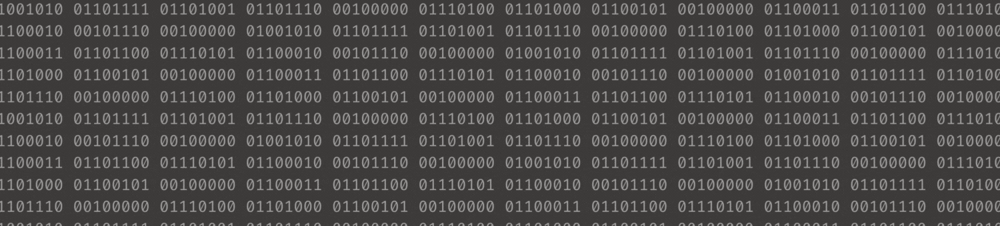

# Hello World 

This is AURAK's Student Coding Club. Welcome to our GitHub repository! Our club is dedicated to fostering a passion for coding and technology among students at the American University of Ras Al Khaimah. Whether you're a beginner or an experienced coder, our club offers a welcoming community where you can learn, collaborate, and unleash your creativity through coding projects and activities.

The Coding Club brings together tech enthusiasts for a range of exciting activities that blend learning with fun. From sharing weekly tech talks on WhatsApp and Instagram to lively biweekly dev discussions in G's AutoCAD lab (live streaming on Google Meets). We spice things up with coding competitions, handy tech tool recommendations, and review sessions during midterm and final exam periods. Plus, we're not afraid to venture beyond campus, organizing field trips to conferences and tech events. Wait there's more: memes, polls, news, and typeathons!

Our club upholds a set of principles to foster a positive and inclusive environment for all members. We prioritize respect, inclusivity, collaboration, professionalism, integrity, safety, diversity, and responsibility in all club activities. By joining our club, members commit to treating others with kindness and respect, regardless of differences in background, identity, or skill level. We encourage collaboration, constructive feedback, and professionalism in all interactions. Safety and well-being are paramount, and we embrace the diversity of perspectives, experiences, and ideas within our community. Members are expected to uphold these principles and take responsibility for their actions. Any violations of this code of conduct will be addressed by club leadership in accordance with club policies. As members of the Coding Club, it is imperative that we also adhere to the rules and regulations set forth by the American University of Ras Al Khaimah as well as embrace the cultural values of the United Arab Emirates.

  
 Recurring Tasks

  - [ ] Prepping the Tech Talk Whatsapp post (news - announcements - questions). [@Youssef](https://github.com/YoussefAzizeldin)
  - [ ] Prepping materials, spotlight project, agenda, and activities for the weekly Dev Discussion.
  - [ ] Staying active on socials. [@Hazim](https://github.com/win-x-u-r)
  - [ ] Submit budget and clearance requests to the Club Committee & Student Government Association to announce activities. [@Nour](https://github.com/Nour-MK)
  - [ ] Collecting resources to recommend. [@Shamsi](https://github.com/M-Alshamsi)
  - [ ] Requesting Coding Club Tech Titans certificates semesterly. [@Nour](https://github.com/Nour-MK)
  - [ ] Requesting midterm and final practice exams from department faculty semesterly to hold course review sessions.
  - [ ] Updating the leaderboard weekly. [@Nour](https://github.com/Nour-MK)

  
 Future Plans 

  - [ ] Host the signature event of the 2nd club relaunch.
  - [ ] Compile a list of all websites on which the @aurak handle is recognizable as a student email (educational privileges).
  - [ ] Compile important research papers for dev discussions.
  - [ ] Request appreciation certificates for all management members.
  - [ ] Request volunteers for the programming languages introductory A4 posters.
  - [ ] Organize an event with an outside speaker.
  - [ ] Organize a debugging workshop.
  - [ ] Organize an API workshop.
  - [ ] Organize a dependency management workshop.
  - [ ] Organize a documentation reading and navigation workshop.
  - [ ] Organize short, recurring, time-limited online competitions (leaderboard?)
  - [ ] Finalize the middle section of the Computer Science & Engineering board renovation.

  
 Spring 2024 Achievements 

- [x] Renovate club's pfp, logo, poster, Tech Talk template, and Dev Discussions agenda template.
- [x] Establish an online presence on Github, Instagram, and TikTok.
- [x] Advertise vacant positions. (x3) 
- [x] Hire a Graphic Designer. [@Abouissa](https://github.com/Mohamed-Abouissa)
- [x] Hire an Ideator. [@Shamsi](https://github.com/M-Alshamsi)
- [x] Hire a Social Media Manager. [@Hazim](https://github.com/win-x-u-r)
- [x] Obtain an email handle.
- [x] Acquire department faculty sponsors.
- [x] Establish Tech Talks: the weekly news, announcements, projects, polls, and memes post.
- [x] Establish Dev Discussions: the fortnightly meet-ups (irl or online) where we cover some CS topics theoretically, showcase an application project of them, and engage the guests through various practical activities.

**Total number of Tech Talks posted: 4**

**Total number of Dev Discussions hosted: 1**

**Total number of Review Rounds posted: 0**

**Total number of Events organized: 0**

**Total amount of budget used: 1125.5 AED**

This is a semesterly competitive leaderboard set to foster student engagement in club activities. Top 3 ranks will be awarded Coding Club Tech Titan certificates from AURAK's Department of Computer Science & Engineering.

  
 How to Collect Points

- **(5 pts)** for voting on weekly Tech Talk polls.
- **(5 pts)** for getting featured in the programming memes competition.
- **(10 pts)** for attending fortnightly Dev Discussions.
- **(10 pts)** for engaging in any requested volunteering activities.
- **(15 pts)** for getting 1st place in typeathons.
- **(15 pts)** for getting 1st place in a mentimeter question.
- **(15 pts)** for participating in official coding club competitions.
- **(20 pts)** for submitting a project to showcase in Dev Discussions.
- **(25 pts)** for winning a 1st, 2nd, or 3rd place in official coding club competitions.

  
Spring 2024 Leaderboard

| Rank | Member     | Score |
|:----:|:----------:|:-----:|
|🏆| **Muhammad Mbarak**  | **40** |
|🥈| **Ahmed Abuhajjaj**   | **35** |
|🥉| **Abdulghani Sabbagh**  | **25** |
| **4**| **Maram Sabri**  | **15** |
| **5**| **Lina Abdalmajeed**  | **10** |
| **6**| **Urita Sadallah**| **10** |
| **7**|  **Abin Devarajan**  | **10** |
| **8**| **Nada Mohamed**  | **10** |
| **9**| **Hinad Fransis**  | **10** |
| **10**| **Fares Masarani**  | **10** |
| **11**| **Abdullah Yousef**  | **10** |
| **12**| **Yousef Al Hayek**  | **5** |

- **President:** Nour Mostafa
- **Vice President:** Youssef Aziz
- **Ideator:** Mohammed Alshamsi
- **Graphic Designer:** Mohamed Abouissa
- **Social Media Manager:** Hazim Anwar

  
Ex-Team

- **President:** Hinad Fransis
- **Vice President:** Ghaleb Aldoboni
- **Executive:** Mai Mansour
- **Executive:** Mazin Khider

  
#

We value your feedback! If you have any suggestions or ideas for improving the coding club's activities and events, please share them with us by sending us either an email, dm on Instagram, or WhatsApp. Your input helps us enhance the club experience for all members.

To apply as a staff member, please visit https://docs.google.com/forms/d/134o8TTd5PHuxOQBgE31H91YpiyGFyZ9guDSMdyJWGeg.
